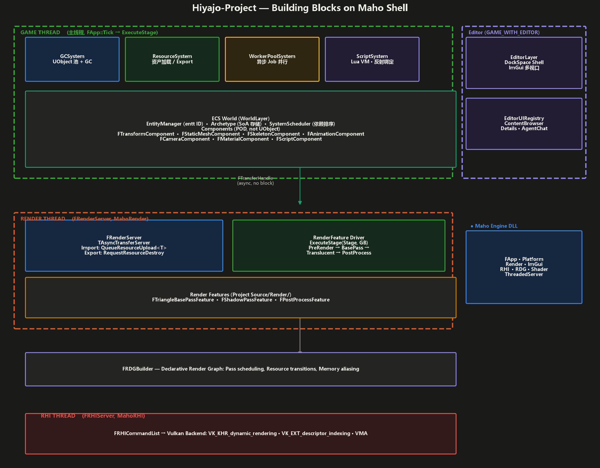
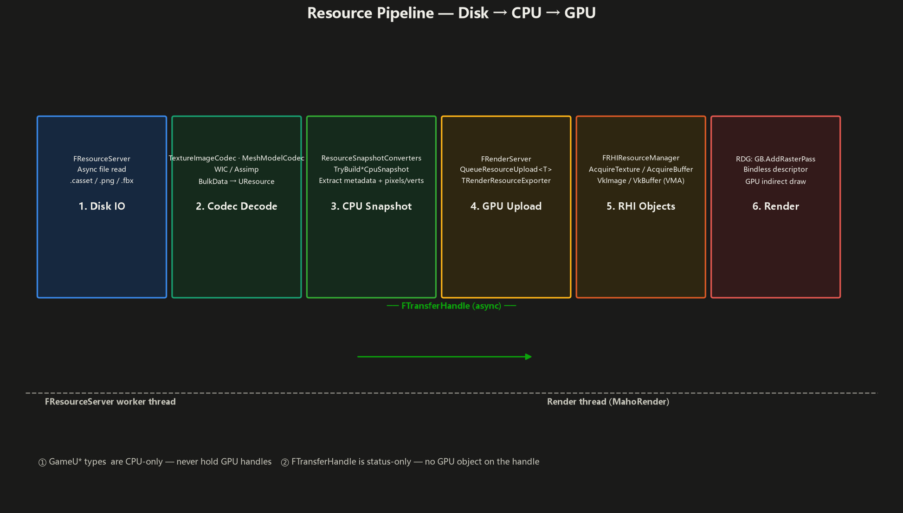

# Hiyajo-Project — Game Project on Maho Shell

> **Hiyajo-Project is a game project built on the Maho engine shell.** It demonstrates how to assemble game-level systems (Object/GC, Resource, ECS, Script) and a custom render pipeline on top of the engine's minimal infrastructure.

## Architecture — Building Blocks on a Shell



## How to Read This Stack

The engine (bottom) provides **five infrastructure primitives**:

1. **`FApp`** drives the extension lifecycle (Init → Tick → Shutdown)
2. **`FPlatformSystem`** gives you a window, input, and file I/O
3. **`FRenderSystem`** starts a render thread with `FRenderServer`
4. **`RHI`** talks to Vulkan (resources, queues, command lists)
5. **`RDG`** lets you declare render passes without managing GPU state

The project builds on these five primitives by adding **systems** (GC, Resource, Script) and **features** (custom render passes). The engine never calls into the project — the project plugs itself into the engine's extension discovery.

## Project Structure

```text
Hiyajo-Project/
├── Hiyajo-Project.cproject         # Project descriptor (like .uproject)
├── Source/
│   ├── Game/                       # Game logic (EngineExtensions)
│   │   ├── Object/                 #   UObject / UPackage / FObjectRef
│   │   │   ├── Object.h/cpp        #     Pool-allocated base class
│   │   │   ├── Package.h/cpp       #     Asset container
│   │   │   ├── SoftObjectPath.h    #     Asset path → lazy resolve
│   │   │   └── PoolAllocator.h     #     Fixed-size block allocator
│   │   ├── System/
│   │   │   ├── GC/
│   │   │   │   └── GCSystem.h/cpp  #     Garbage collector + pool registry
│   │   │   ├── Resource/
│   │   │   │   ├── ResourceSystem.h/cpp    # Asset manager (load, import, cache)
│   │   │   │   ├── ResourceServer.h/cpp    # Async file IO (TAsyncTransfer)
│   │   │   │   ├── ResourceIO.h/cpp        # Import/Export codec dispatch
│   │   │   │   ├── ResourceObject.cpp      # UResource base implementation
│   │   │   │   ├── ResourceCasset.h/cpp    # .casset package format
│   │   │   │   ├── TextureImageCodec.h/cpp # WIC texture decoder
│   │   │   │   └── MeshModelCodec.h/cpp    # Assimp mesh decoder
│   │   │   └── Script/
│   │   │       ├── ScriptSystem.h/cpp      # Lua VM manager
│   │   │       └── LuaObjectReflect.h/cpp  # UObject → Lua bindings
│   │   ├── ECS/                     # Entity-Component-System
│   │   │   ├── World.h/cpp          #   ECS world (entities, archetypes)
│   │   │   ├── EntityManager.h/cpp  #   Entity create/destroy/deferred
│   │   │   ├── Archetype.h/cpp      #   SoA component storage
│   │   │   ├── ComponentType.h      #   Component type ID registry
│   │   │   ├── EntityHandle.h       #   Lightweight entity reference
│   │   │   ├── Query.h              #   Archetype-filtered iteration
│   │   │   ├── System.h             #   System base class
│   │   │   └── SystemScheduler.h/cpp#   System dependency + execution
│   │   ├── World/                   # Scene organization
│   │   │   ├── WorldLayer.h/cpp     #   ECS world lifecycle extension
│   │   │   ├── Components/
│   │   │   │   └── TransformComponent.h  # Position, rotation, scale
│   │   │   └── Systems/
│   │   │       ├── CameraSystem.h/cpp    # Camera entity management
│   │   │       └── MovementSystem.h/cpp  # Simple transform updates
│   │   ├── Editor/                  # Editor UI (GAME_WITH_EDITOR)
│   │   │   ├── EditorLayer.h/cpp    #   ImGui DockSpace shell
│   │   │   ├── EditorUIRegistry.h/cpp#  Panel registration
│   │   │   └── AgentChatClient.h/cpp#   AI agent chat panel
│   │   ├── Script/
│   │   └── Components/              # One header per ECS component
│   │       ├── TransformComponent.h
│   │       ├── CameraComponent.h
│   │       ├── StaticMeshComponent.h
│   │       ├── SkeletonComponent.h
│   │       ├── AnimationComponent.h
│   │       ├── MaterialComponent.h
│   │       ├── ScriptComponent.h
│   │       └── MainCameraTag.h
│   └── Render/                      # Custom render pipeline
│       ├── Forward/                 #   GPU-driven forward renderer
│       ├── MahoCommonUniforms.h      #   Frame/Object uniform structs (std140)
│       └── ResourceSnapshots.h        #   CPU snapshot structs (project-side)
├── Shaders/                         # Project-specific shaders
│   └── Forward/                     #   Forward renderer shaders (comp/vert/frag)
├── Intermediate/
│   └── Generated/                   # Codegen output (gitignored)
│       ├── Hiyajo-ProjectApp.cpp    #   Auto-registered extensions + features
│       └── ObjectReflectTypes.gen.* #   Reflection tables
├── Binaries/Win64/Debug/
│   ├── Hiyajo-Project.exe
│   ├── Maho.dll                     #   Engine DLL
│   └── assimp-vc142-mt.dll         #   Mesh import
├── Config/                          # Runtime configuration
├── Content/                         # Game assets (.casset, textures, models)
├── Scripts/                         # Lua scripts (main.lua)
└── Plugins/                         # Project-specific plugins
```

## Key Design Decisions

### 1. UObject ≠ ECS Entity

| Concept | UObject | ECS Entity |
|---------|---------|------------|
| **Inheritance** | Inherits `UObject` | Plain `uint64_t` ID |
| **Allocation** | GC pool (block allocator) | Archetype chunk (SoA) |
| **Identity** | `FObjectRef` (ref-counted pointer) | `FEntityHandle` (ID + generation) |
| **Persistence** | Serialized via `.casset` | Serialized as binary blob in `ULevel` |
| **Components** | Fixed class hierarchy | Composable POD `F*Component` |
| **Used for** | Assets (textures, meshes, levels) | Runtime entities (actors, cameras) |

### 2. Resource Pipeline



### 3. Shader Compilation

```
Forward/ForwardCulling.comp + Forward.vert + Forward.frag (raw GLSL)
  │  CompileStage → glslang → SPIR-V
  ▼
ShaderCompiler (glslang)
  │  GLSL → SPIR-V + reflection JSON
  ▼
ShaderDatabase
  │  Per-pass compiled bytecode hash (vertex + fragment SPIR-V)
  ▼
FRDGBuilder::AddRasterPass("BasePass", ...)
  │  PSO created from SPIR-V hash
  ▼
Vulkan Pipeline (Dynamic Rendering · Bindless Descriptors)
```

### 4. Extension Registration (No Manual Wiring)

Codegen (`maho_tools.py`) scans the source tree and generates `Hiyajo-ProjectApp.cpp`:

```cpp
// Auto-generated — DO NOT EDIT
virtual bool PreInitialize() override
{
    RegisterExtension<Maho::FPlatformSystem>(EExtensionPriority::System);
    RegisterExtension<Maho::FRenderSystem>(EExtensionPriority::System);
    RegisterExtension<Maho::FGCSystem>(EExtensionPriority::System);       // ← Scanned
    RegisterExtension<Maho::FResourceSystem>(EExtensionPriority::System); // ← Scanned
    RegisterExtension<FGameWorldLayer>(EExtensionPriority::Layer);            // ← Scanned
    RegisterExtension<Maho::FScriptSystem>(EExtensionPriority::Overlay);
    RegisterExtension<Maho::FEditorLayer>(EExtensionPriority::Overlay);
    return true;
}

virtual bool PostInitialize() override
{
    GetExtension<Maho::FRenderSystem>()->RegisterFeature<Maho::FForwardRendererFeature>();
    return true;
}
```

**To add a new feature:**
1. Create `Source/Game/Systems/MySystem.h` — an `ISystem`, register in `FGameWorldLayer::RegisterSystems`
2. Or create `Source/Render/MyPassFeature.h` — auto-registered as RenderFeature
3. Rebuild — that's it.

## ECS Quick Reference

```cpp
// Create a world (via WorldLayer or standalone)
FECSWorld World;

// Create an entity
auto Entity = World.CreateEntity("Player");
Entity.AddComponent<FTransformComponent>({ .Position = {0,0,0}, .Rotation = {0,0,0,1}, .Scale = {1,1,1} });
Entity.AddComponent<FCameraComponent>({ .FOV = 60.0f, .NearPlane = 0.1f, .FarPlane = 1000.0f });

// Query entities
for (auto [Transform, Camera] : World.Query<FTransformComponent, FCameraComponent>())
{
    // Process camera entities
}

// Systems run via SystemScheduler with dependency ordering
FCameraSystem CameraSystem;
FMovementSystem MovementSystem;
Scheduler.AddSystem(&MovementSystem, "Movement");
Scheduler.AddSystem(&CameraSystem, "Camera", {"Movement"}); // Camera depends on Movement
```

## Build

```bat
# From Visual Studio — just open the .sln generated by .cproject

# CLI build
cmake --build Intermediate --target Hiyajo-Project --config Debug

# Run
Binaries/Win64/Debug/Hiyajo-Project.exe
```

## Editor Mode

Enable `GAME_WITH_EDITOR` in CMake to build the ImGui editor:

- **DockSpace**: Multi-panel layout with undocking
- **Content Browser**: Asset navigation and import
- **Agent Chat**: AI-powered editing assistance
- **Details Panel**: Entity/component property inspection
- **Viewport**: Render output with camera controls
